<!-- toc-start -->

* [0. 前言](#0-前言)
* [1. 开发环境配置](#1-开发环境配置)
* [2. GPIO](#2-gpio)
    * [2.1 芯片引脚分布](#21-芯片引脚分布)
    * [2.2 IO复用和重映射](#22-io复用和重映射)
    * [2.3 四种输出模式](#23-四种输出模式)
    * [2.4 最大IO速度](#24-最大io速度)
    * [2.5 点灯大师！](#25-点灯大师)
    * [2.6 四种输入模式](#26-四种输入模式)
    * [2.7 按钮实验！](#27-按钮实验)
* [3. UART](#3-uart)
    * [3.1 基础知识](#31-基础知识)
    * [3.2 使用串口简单地发送数据！](#32-使用串口简单地发送数据)
    * [3.3 使用串口简单接收数据！](#33-使用串口简单接收数据)
* [4. I2C](#4-i2c)
    * [4.1 基础知识](#41-基础知识)
    * [4.2 I2C简单数据收发！](#42-i2c简单数据收发)
* [5. 时钟系统](#5-时钟系统)
    * [5.1 基础知识](#51-基础知识)
    * [5.2 时钟树配置实验！](#52-时钟树配置实验)
* [6. SPI](#6-spi)
    * [6.1 总线结构](#61-总线结构)
    * [6.2 SPI的5个参数](#62-spi的5个参数)
    * [6.3 按钮实验](#63-按钮实验)

<!-- toc-end -->

# 0. 前言

本学习笔记是基于STM32F103C8T6的学习笔记，使用stm32cubemx和vscode基于cmake作为开发工具链，在archlinux上进行开发，使用stm32f103c8t6最小系统板作为开发板

本笔记主要参考这个[视频教程](https://www.bilibili.com/video/BV16J4m1w7HB?vd_source=c8cd7191b3d178cf10b977901b2d6df4&spm_id_from=333.788.videopod.sections)

# 1. 开发环境配置

1. 软件包下载

```
sudo pacman cmake  //提供构建工具
sudo pacman vscode //代码编写、调试、提供交叉编译工具、下载到soc
paru -S stm32cubemx //图形化配置引脚功能
paru -S archlinux-java-run //为stm32cubemx提供运行环境

```

使用任意方式下载serial port assistant，获得串口调试功能，执行命令`sudo usermod -a -G uucp $USER`获得串口访问权限，您可能需要重启以使该设置生效

2. vscode插件下载  
   搜索STM32CubeIDE for Visual Studio Code，下载发布者为STMicroelectronics的插件包

# 2. GPIO

## 2.1 芯片引脚分布

1. 引脚分为**普通IO引脚**和**特殊功能引脚**  
   特殊功能引脚具有特殊的，特定的功能，用户无法通过编程来控制它们，例如有些引脚为芯片电源引脚，其中Vdd接电源正极，Vss接地

    > tips:这是因为一般来说mos管的d极接电源正极，s极接地

    VBAT引脚通常用来连接备用电池，NRST引脚用于芯片复位，BOOT0引脚用于控制芯片的启动模式

2. 普通引脚分为GPIOA，GPIOB，GPIOC，GPIOD四组  
   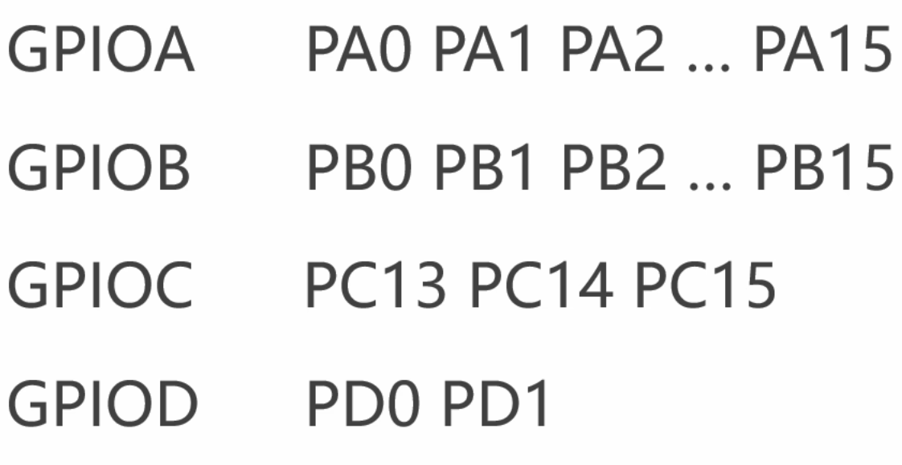

## 2.2 IO复用和重映射

1. IO复用  
   IO复用是指一个引脚具备多种功能，例如一个引脚既可以作为串口也可以作为定时器的某个通道等等，当我们使用某个引脚的复用功能时，意味着我们不再是简单地对一个引脚写0或者写1，而是通过某种约定俗成的、特定的方式来使用某个引脚

2. 复用功能重映射  
   将冲突的复用功能移动到备用引脚上去

## 2.3 四种输出模式

GPIO(General Purpose Input Output)通用目的的输入输出

四种输出模式：
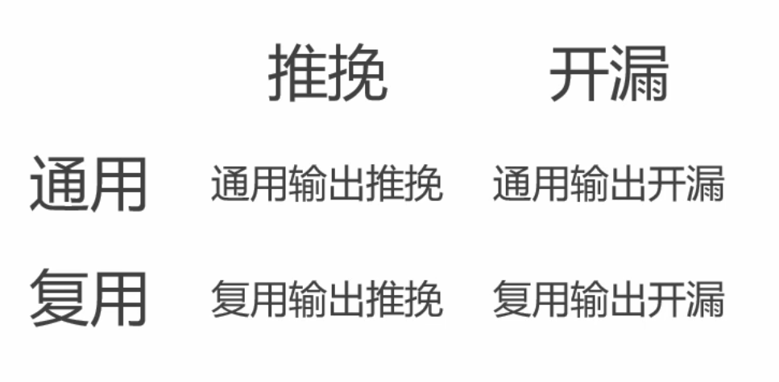

1. 推挽 vs 开漏  
   推挽和开漏本质上是在控制mos管的关断上的逻辑区别  
   下图为连接引脚的两个mos管的连接方式
   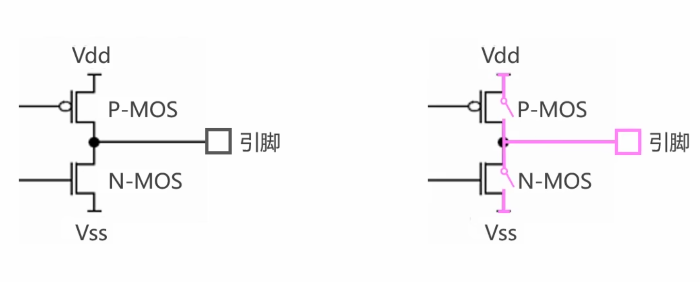

    推挽的本质是mosfet交替导通，开漏的本质是上管恒断
    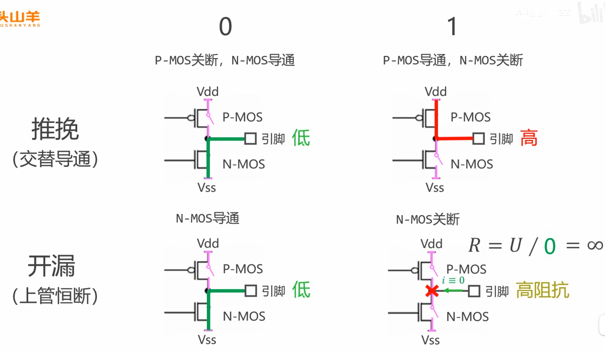

2. 通用 vs 复用  
   通用：通过直接在引脚上写一或写零控制引脚上的高低电平  
   复用：由其他模块托管

## 2.4 最大IO速度

在理想状态下，1和0之间的转换应该是瞬时的，然而实际上却是从1缓慢降到0、从0缓慢升到1，我们将电压升高所需的时间叫作**上升时间**，电压下降所需的时间叫作**下降时间**，中间输出有效电平的时间称为**保持时间**  
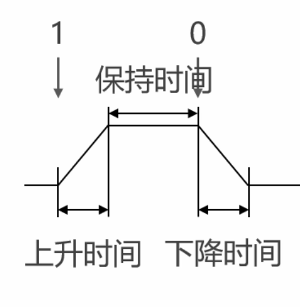

不难看出随着高低电平的切换速度逐渐加快，保持时间会越来越短，最终直到上升沿和下降沿完全重合

上升时间和下降时间限制了最大IO速度，上升时间和下降时间越短，最大输出速度就越大

| 速度 | 上升时间 | 保持时间 | 下降时间 | 最大输出速度 |
| ---- | -------- | -------- | -------- | ------------ |
| 低速 | 125ns    | 250ns    | 125ns    | 2MHz         |
| 中速 | 25ns     | 50ns     | 25ns     | 10MHz        |
| 高速 | 5ns      | 10ns     | 5ns      | 50MHz        |

运用时选取满足要求的最小值，因为过快的上升时间和下降时间会增大功耗，同时会更容易对电路板上的其他元器件产生干扰

## 2.5 点灯大师！

1. 打开stm32cubemx
2. 选择stm32f103c8t6开始项目
3. system core选项中选择sys
4. 将debug模式调整为serial wire
5. 选择project manager将toolchain调整为cmake
6. 本次实验采用stm32f103c8t6最小系统板，最小系统板的pc13引脚以开漏接法连接了一颗板载led，同时本次实验还希望通过推挽输出的方式点亮另一颗led，选择PA9引脚
7. 鼠标点击PA9引脚和PC13引脚，均选择GPIO_Output
8. 在system core中的GPIO选项中调节各引脚参数
9. PA9选择GPIO output level为low设置初始值为低电平，GPIO mode为Output Push Pull设置为推挽输出
10. PC13设置GPIO output level为high设置初始值为高电平，GPIO mode设置为Output Open Drain开漏输出
11. 点击generate code
12. 在while循环写入如下代码

```C
while (1){
    HAL_GPIO_WritePin(GPIOC, GPIO_PIN_13, GPIO_PIN_RESET);
    HAL_GPIO_WritePin(GPIOA, GPIO_PIN_9, GPIO_PIN_SET);

    HAL_Delay(500);

    HAL_GPIO_WritePin(GPIOC, GPIO_PIN_13, GPIO_PIN_SET);
    HAL_GPIO_WritePin(GPIOA, GPIO_PIN_9, GPIO_PIN_RESET);

    HAL_Delay(500);

}
```

## 2.6 四种输入模式

输入上拉，输入下拉，输入浮空，模拟模式  
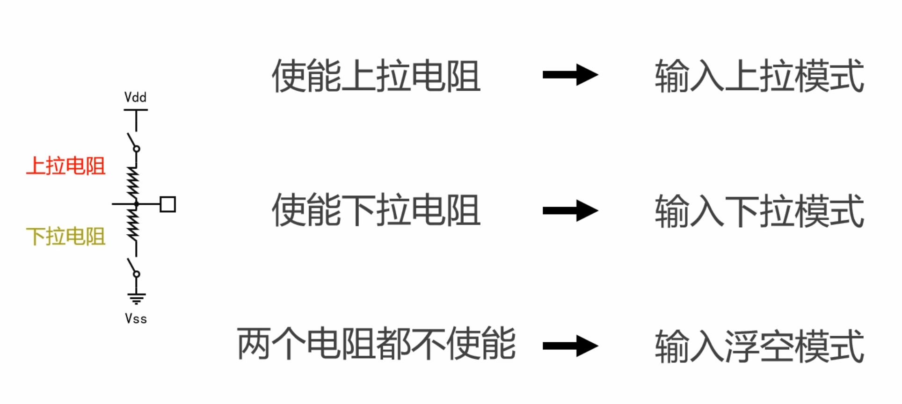

上下拉电阻作用如下  
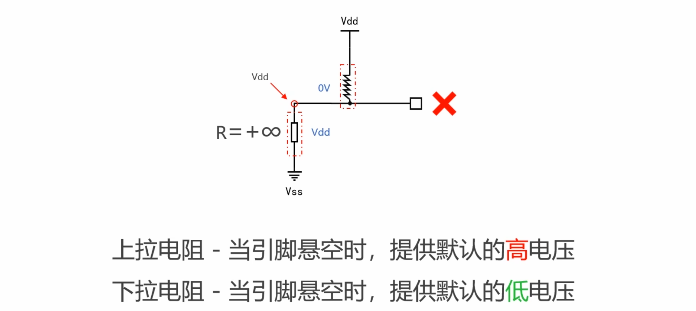

## 2.7 按钮实验！

实验目的：通过按下按钮控制板载led的亮灭，按下按钮时led亮，松开按钮时，led灭  
本实验采用PA9连接按钮

1. 基础配置与之前相同
2. 设置PA9为GPIO_Input，设置GPIO Pull-up/Pull-down为Pull-up
3. 写入如下代码

```C
while (1){
    if(HAL_GPIO_ReadPin(GPIOA, GPIO_PIN_9)){
      HAL_GPIO_WritePin(GPIOC, GPIO_PIN_13, GPIO_PIN_SET);
    }
    else{
      HAL_GPIO_WritePin(GPIOC, GPIO_PIN_13, GPIO_PIN_RESET);
    }
  }
```

# 3. UART

## 3.1 基础知识

1. UART定义与接线  
   UART，即串口，是一种通信接口，由两条线组成，Tx和Rx，其中Tx(Transmit)用于发送数据，Rx(Receive)用于接收数据  
   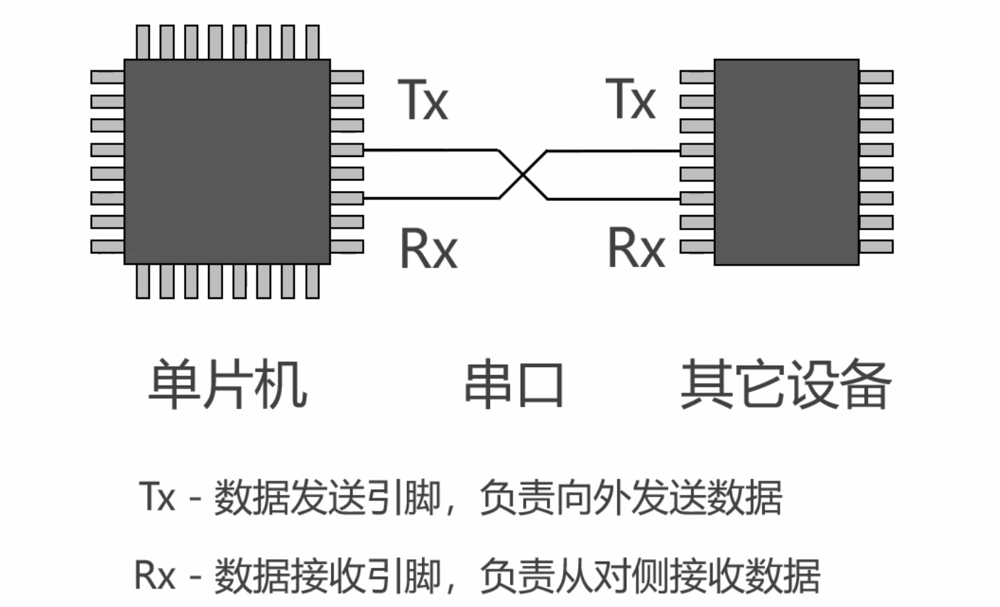  
   两个设备的Tx和Rx应交错连接
2. 串口的数据帧格式  
   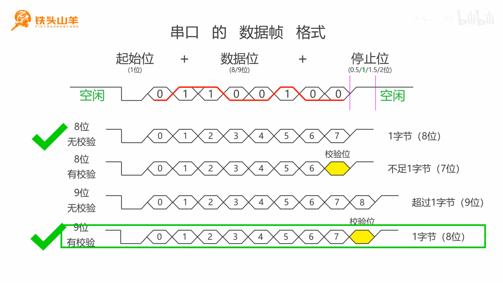
3. 校验位  
   奇校验：要求数据中包含奇数个1  
   欧校验：要求数据中包含偶数个1
   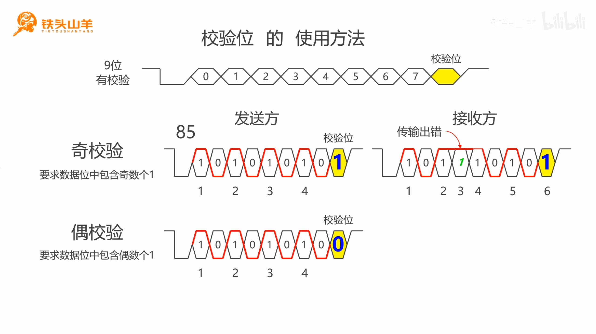
4. 波特率  
   每秒钟传输位的数量  
   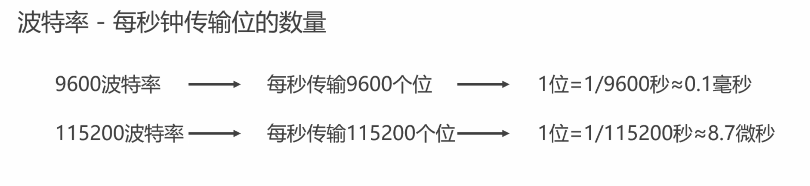  
   收发双方应选择相同的波特率
5. UART vs USART  
   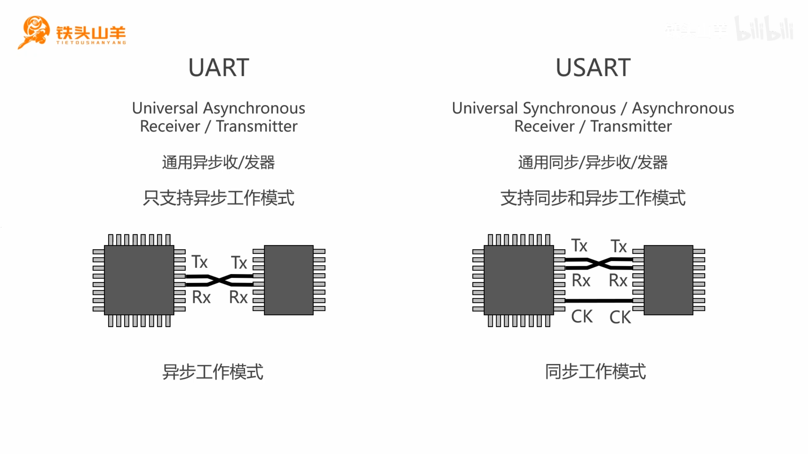

## 3.2 使用串口简单地发送数据！

1. 在connectivity中选择USART1，选择mode为Asynchronous即异步通信模式
2. word length 选择8 Bits(including parity)
3. parity 选择none
4. data direction 选择receive and transmit
5. generate code
6. 写入如下代码

```C
uint8_t byteNumber = 0x5a;
uint8_t byteArray[] = {1, 2, 3, 4, 5};
char ch = 'a';
char *str = "Hello world";

HAL_UART_Transmit(&huart1, &byteNumber, 1, HAL_MAX_DELAY);

HAL_UART_Transmit(&huart1, byteArray, 5, HAL_MAX_DELAY);

HAL_UART_Transmit(&huart1, (uint8_t*)&ch, 1, HAL_MAX_DELAY);

HAL_UART_Transmit(&huart1, (uint8_t*)str, strlen(str), HAL_MAX_DELAY);
```

7. 在串口调试助手中设置与cubemx中相同的波特率、word length等
8. 开始调试、观察输出

**单片机数据类型**
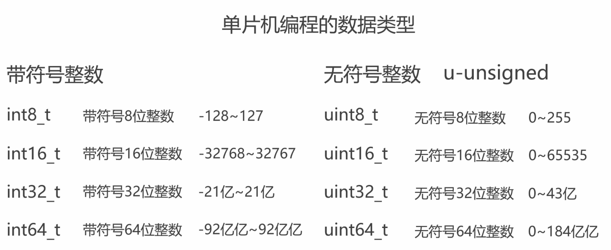

**串口发送数据接口**  
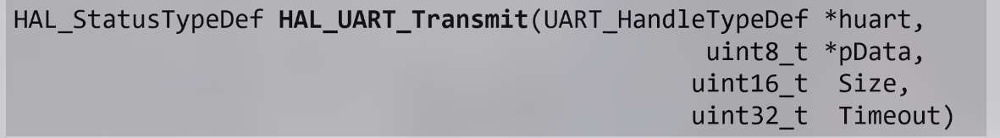  
**各参数作用**
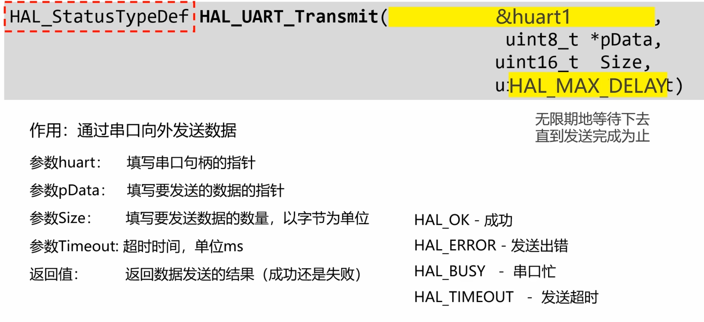

## 3.3 使用串口简单接收数据！

本实验目的为根据串口接收到的数据控制板载led的亮灭

写入如下代码

```C
while (1){
    uint8_t dataRcvd = 1;

    HAL_UART_Receive(&huart1, &dataRcvd, 1, HAL_MAX_DELAY);

    if (dataRcvd == '0') {
        HAL_GPIO_WritePin(GPIOC, GPIO_PIN_13, GPIO_PIN_SET);
    }
    else if (dataRcvd == '1') {
        HAL_GPIO_WritePin(GPIOC, GPIO_PIN_13, GPIO_PIN_RESET);
  }
}
```

# 4. I2C

## 4.1 基础知识

串口只能实现一对一的信息传输，面对更多的设备时就显得有些力不从心，所以我们可以采用使用总线结构的I2C

I2C使用两条线进行主机与从机的连接：

1. SCL(Serial Clock)串行时钟线，负责传输时钟信号
2. SDA(Serial Data)串行数据线，负责传输数据

I2C一般需要在SCL和SDA上外接两颗上拉电阻，电阻阻值一般选择4.7k，SCL和SDA都应该选择开漏输出，这样做是因为我们希望能实现逻辑线与

I2C通信过程：

1. 起始位：主机向从机发送起始位，即在SCL是高电压时，向SDA发送下降沿
2. 寻址：主机向总线发送从机的地址，而后补上一位R/W#位，R代表read读，W代表write写，#代表低电压有效，R/W = 0，代表从从机写数据，R/W = 1时，代表从从机读数据，从机把SDA拉低从而释放一个应答信号Ack告诉主机寻址成功，如不成功称为Nak

> Nak原因
>
> 1.  地址填错
> 2.  要寻址的从机正忙，没来得及回复ACK
> 3.  从机故障

3. 数据传输，I2C以字节为单位传输数据，每次可以传输多个字节，主机每发送一个字节，从机都通过把SDA拉低来发送一个ACK
4. 停止位：在SCL是高电压时，向SDA发送上升沿

I2C模式：  
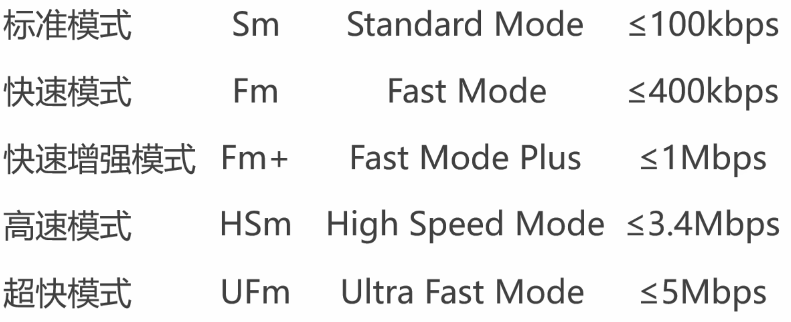

快速模式可以设置时钟信号的占空比：

1. $T_{Low} / T_{High} = 2/1$
2. $T_{Low} / T_{High} = 16/9$

## 4.2 I2C简单数据收发！

目标：点亮OLED屏幕，同时通过读取OLED屏幕返回的数据判断OLED屏幕是否被点亮，如果被点亮则点亮板载LED

本次实验使用一块以ssd1306为驱动芯片的0.96英寸oled屏幕

1. 创建工程，将debug模式调整为serial
2. 将pc13引脚的模式调整为gpio output，以开漏模式进行输出，初始电平为高电平
3. 打开I2C1，将i2c模式调整为高速模式，
4. 写入代码

```C
uint8_t commands[] = {0x00, 0x8d, 0x14, 0xaf, 0xa5};

HAL_I2C_Master_Transmit(&hi2c1, 0x78, commands, sizeof(commands)/sizeof(commands[0]), HAL_MAX_DELAY);

uint8_t dataRcvd;
HAL_I2C_Master_Receive(&hi2c1, 0x78, &dataRcvd, 1, HAL_MAX_DELAY);

if ((dataRcvd & (0x01 << 6)) == 0) {
    HAL_GPIO_WritePin(GPIOC, GPIO_PIN_13, GPIO_PIN_RESET);
}
else {
    HAL_GPIO_WritePin(GPIOC, GPIO_PIN_13, GPIO_PIN_SET);
}
```

5. 如果板载led点亮，且oled屏幕显示为白色则实验成功

# 5. 时钟系统

## 5.1 基础知识

stm32单片机总线示意图：
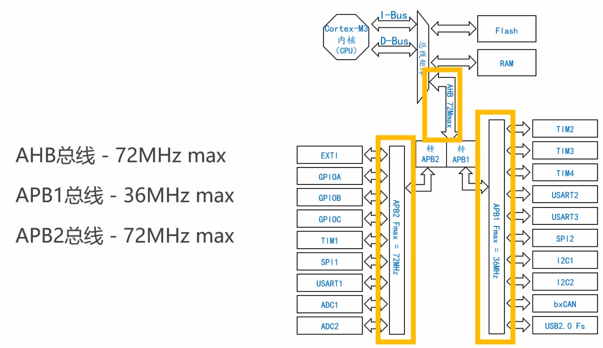

数字逻辑电路：

1. 组合逻辑电路
2. 时序逻辑电路

时钟分类  


> H-HighSpeed  
> L-LowSpeed  
> E-External  
> I-Internal

时钟树示意图：  
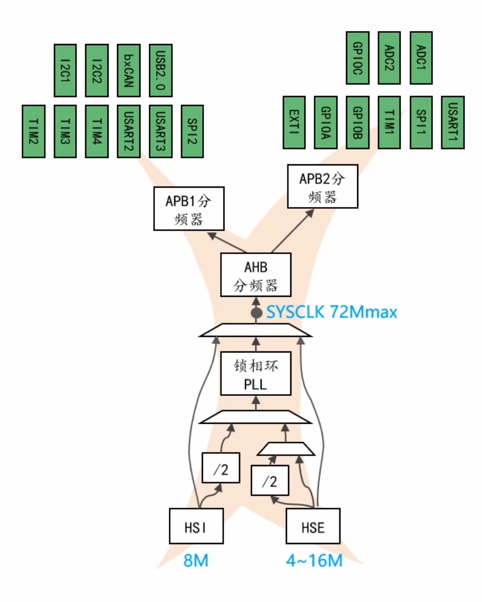

## 5.2 时钟树配置实验！

1. 创建工程，配置pc13为开漏输出，初始电平为高电平
2. 写入如下代码：

```C
while (1)
  {
    uint32_t i;

    HAL_GPIO_WritePin(GPIOC, GPIO_PIN_13, GPIO_PIN_RESET);

    for (i = 0; i < 1000000; i++);

    HAL_GPIO_WritePin(GPIOC, GPIO_PIN_13, GPIO_PIN_SET);

    for (i = 0; i < 1000000; i++);
  }
```

3. 将代码烧录进板子，观察到板载led以一个较慢的速度进行闪烁
4. 在system_core/high speed clock(HSE)中，将值调整为crystal/ceramic resonator
5. 在clock configuration中让pll选择hse作为来源，倍频器选择9倍，sysclk来源选择pll，ahb分频选择/1，apb1分频选择/2，apb2分频选择/1
6. 保证HCLK为72MHz，PCLK1为36MHz，PCLK2为72MHz
7. 将代码烧录进板子，观察到板载led以一个较快的速度进行闪烁

# 6. SPI

## 6.1 总线结构

- MOSI：master output slave input
- MISO：master input slave output
- SCK：serial clock
- NSS：negative slave select低电压有效从机选择线

## 6.2 SPI的5个参数

1. 波特率：spi没有规定波特率，但在实际项目中一般选取几兆到几十兆Hz之间
2. 比特位传输顺序，最低有效位(LSB First)先行还是最高有效位先行(MSB First)
3. 数据位长度(8bit/16bit)
4. 时钟的极性(低极性/高极性)空闲状态下时钟线为低电平还是高电平
5. 时钟的相位：
    1. 第一边沿采集
    2. 第二边沿采集

4种时钟模式  
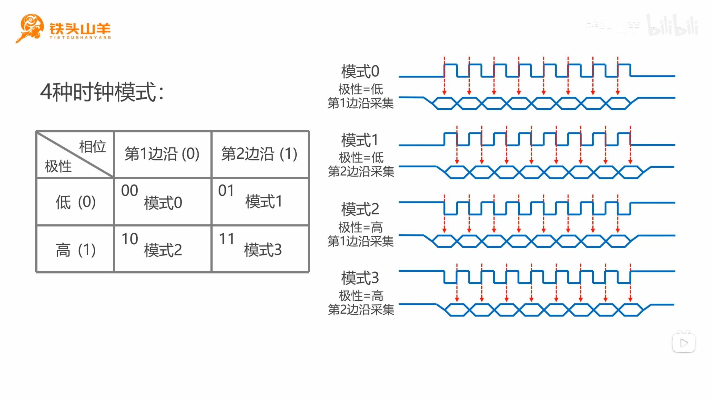

## 6.3 按钮实验

本次实验的目的是每按一次按钮就切换一遍板载led的状态

实验步骤：

1. 新建项目，配置debug为serial wire
2. 配置pa0为gpio_input，PC13设置为开漏输出，初始电平为高电平，pa0设置为输入上拉
3. 写入如下代码：

```C
uint8_t pre = 1, cur = 1;
uint8_t led_state = 0;

while (1)
{
  pre = cur;
  if (HAL_GPIO_ReadPin(GPIOA, GPIO_PIN_0) == GPIO_PIN_SET) {
    cur = 1;
  }
  else {
    cur = 0;
  }

  if (pre != cur) {
    HAL_Delay(10);
    if (cur == 1) {
      if (led_state == 1) {
        HAL_GPIO_WritePin(GPIOC, GPIO_PIN_13, GPIO_PIN_SET);
        led_state = 0;
      }
      else {
        HAL_GPIO_WritePin(GPIOC, GPIO_PIN_13, GPIO_PIN_RESET);
        led_state = 1;
      }
    }
  }
}
```
